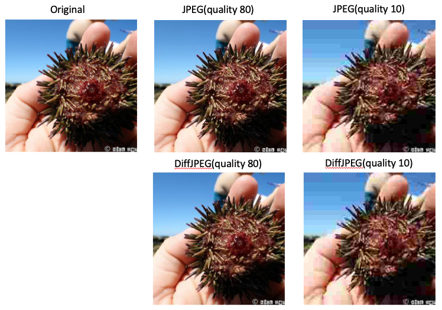

# DiffJPEG: A PyTorch implementation

This is a pytorch implementation of differentiable jpeg compression algorithm.  This work is based on the discussion in this [paper](https://machine-learning-and-security.github.io/papers/mlsec17_paper_54.pdf).  The work relies heavily on the tensorflow implementation in this [repository](https://github.com/rshin/differentiable-jpeg)

## Notice
This is the forked [repository](https://github.com/mlomnitz/DiffJPEG) with such modify:
1. Bug: gets NaN when the quality set to be 100. We add an assert expression in the initialization to ensure a proper quality value.
2. Set all the nn.parameter()'s `requires_grad` flag to False in DiffJPEG, otherwise the JPEG quantization table could be changed after optimization.
3. Add a `p` parameter to control the possibility of compression.

## Requirements
- Pytorch 1.0.0
- numpy 1.15.4

## Use

DiffJPEG functions as a standard pytorch module/layer.  To use, first import the layer and then initialize with the desired parameters:
- differentaible(bool): If true uses custom differentiable rounding function, if false uses standrard torch.round
- quality(float): Quality factor for jpeg compression scheme.

``` python
from DiffJPEG import DiffJPEG
jpeg = DiffJPEG(height=224, width=224, differentiable=True, quality=80)
```


